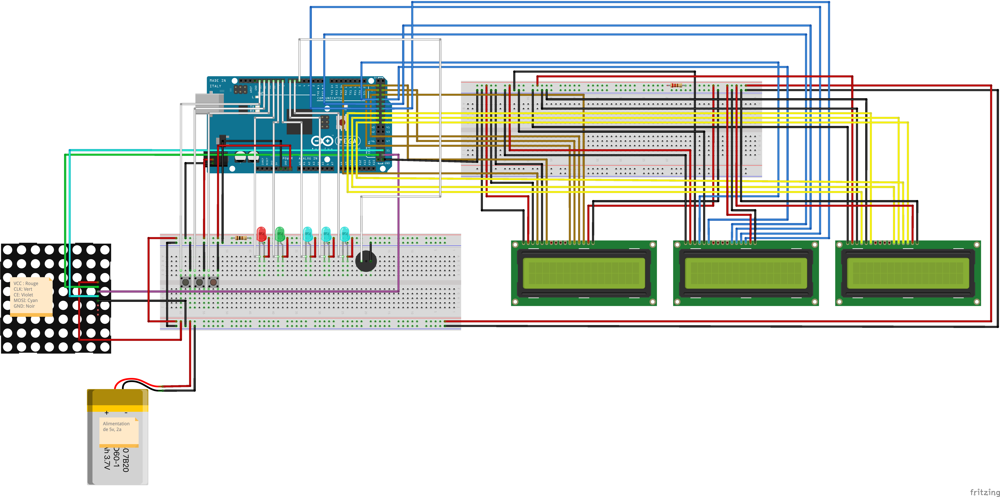

# Matrix quiz - Documentation du Projet

Réalisé par `Joël Gaillard`
Option Arduino 2025 – COMEM+

[Code source](./main/main.ino) (./main/main.ino)
[Fichier Fritzing du schema](./docs/schematics.fzz) (./docs/schematics.fzz)
[Vidéo de démonstration du projet](./docs/assets/matrix-quiz-video-demo.mp4) (./docs/assets/matrix-quiz-video-demo.mp4)

## 1. Description et motivations du projet

### 1.1 Description

Ce projet consiste en un jeu interactif utilisant une matrice LED 8x8, trois écrans LCD 16x2, des leds et des boutons-poussoirs pour créer une expérience ludique et éducative. Le joueur doit identifier des images simples affichées sur la matrice LED et choisir la bonne réponse parmi trois propositions affichées sur trois écrans LCD distincts.

Le jeu comporte **trois modes** :

1. **Mode "Normal"** : 3 vies, score basé sur le temps et les erreurs.
2. **Mode "Time Limit"** : 4 secondes max par question.
3. **Mode "Mort subite"** : Une seule erreur met fin à la partie.

### 1.2 Motivations

- Expérimentation de divers composants arduino (dont la matrice que je trouve particulièrement intéressante)
- Proposer un mini-jeu ludique et interactif avec différents modes de jeux
- Proposer un passe temps lors de courts moments d'ennui à la HEIG-VD (lorsque l'on attend à la pause que la machine ait fini de faire le café par exemple :) )

## 2. État de l'art

### Projets similaires et inspirants

- Projet de quiz utilisant des leds, un lcd 16x2 et un buzzer: https://www.youtube.com/watch?v=HU-3VD1_Pgg
- Projet de dessins simples sur une matrice led arduino: https://youtube.com/shorts/jsiKtfHeaLs?si=bqF50zugfB3S6R69

## 3. Prototype final

## 4. Circuit électronique

### Schéma

### BOM

| Réf  | Composant                                                    | Quantité | Description                                       | Fournisseur / Lien                                           |
| :--- | :----------------------------------------------------------- | -------- | :------------------------------------------------ | :----------------------------------------------------------- |
| 1    | Arduino Mega 2560                                            | 1        | Microcontrôleur ATmega2560, 54 I/O, 16 ADC        | [Arduino](https://store.arduino.cc/products/arduino-mega-2560-rev3?srsltid=AfmBOooPq0zinYuYk_pBqJ9-HFHTcPBJf27sH5tGKckr9_SILuc02-rq) |
| 2    | Breadboard                                                   | 1        | Plaque de prototypage sans soudure                | [Galaxus](https://www.galaxus.ch/de/s1/product/oem-steckplatine-breadboard-transparent-fullsize-breadboard-elektronikzubehoer-gehaeuse-5999390?utm_campaign=organicshopping&utm_source=google&utm_medium=organic&utm_content=406802&supplier=406802) |
| 3    | Cable USB A-B                                                | 1        | Alimentation et programmation Arduino             | [Galaxus](https://www.galaxus.ch/fr/s1/product/value-usb-a-usb-b-3-m-usb-20-cable-usb-219216?dbq=1&supplier=406802&utm_source=google&utm_medium=cpc&utm_campaign=PMax:+PROD_CH_SSC_Cluster_9(C)&campaignid=20488725263&adgroupid=&adid=&dgCidg=CjwKCAiArKW-BhAzEiwAZhWsIOjIjaL-UyLbnw9dGSRZTKmdXXEfspFvgoZJzdYr3Ewl6jRY20zEeBoCXw4QAvD_BwE&gad_source=1&gclid=CjwKCAiArKW-BhAzEiwAZhWsIOjIjaL-UyLbnw9dGSRZTKmdXXEfspFvgoZJzdYr3Ewl6jRY20zEeBoCXw4QAvD_BwE&gclsrc=aw.ds) |
| 4    | 52Pi 8x8 RGB-Matrix mit 4 x 74HC595 - für Raspberry Pi und Arduino | 1        | Affichage matriciel couleur, 64 LEDs              | [Play-Zone](https://www.play-zone.ch/en/52pi-8x8-rgb-matrix-mit-4-x-74hc595-fur-raspberry-pi-und-arduino.html?___from_store=de) |
| 5    | Joy-it com-lcd 16x2 Module écran 6.6 cm (2.6 pouces) 16 x 4 Pixel | 3        | Affichage alphanumérique 16 caractères x 2 lignes | [Conrad](https://www.conrad.ch/fr/p/joy-it-com-lcd-16x2-module-ecran-6-6-cm-2-6-pouces-16-x-4-pixel-convient-pour-kits-de-developpement-arduino-avec-re-1656369.html?utm_source=google-shopping-de&utm_medium=search&utm_campaign=shopping-online-de&utm_content=shopping-ad_cpc&WT.srch=1&ef_id=CjwKCAiArKW-BhAzEiwAZhWsINS1LA6vcltxqtAnVbfixMqVTuZ0FNPhRXJQAgRU3XWc8ZJzN-WmNhoCDt8QAvD_BwE%3AG%3As&utm_source=google&utm_medium=cpc&utm_campaign=ade_3_shopping_GERMAN&utm_id=319998844&gad_source=4&gclid=CjwKCAiArKW-BhAzEiwAZhWsINS1LA6vcltxqtAnVbfixMqVTuZ0FNPhRXJQAgRU3XWc8ZJzN-WmNhoCDt8QAvD_BwE) |
| 6    | Boutons poussoirs Sparkfun COM-10302                         | 3        | Interrupteurs momentanés pour interaction         | [Mouser](https://www.mouser.ch/ProductDetail/SparkFun/COM-10302?qs=WyAARYrbSnaYi0oOM0cIVQ%3D%3D&mgh=1&utm_id=20002739518&utm_source=google&utm_medium=cpc&utm_marketing_tactic=emeacorp&gad_source=4&gclid=CjwKCAiArKW-BhAzEiwAZhWsICijtPXbtdvD5dynsa3FlASc-gvoGki40zJ0tojuq6w_NoWlP-6vMRoCfoAQAvD_BwE) |
| 7    | Leds bleues                                                  | 3        | Indicateur visuel                                 | [Arduino](https://store.arduino.cc/products/set-of-70-assorted-color-5mm-leds?queryID=1b061a37cc74efad95f1c7123696f21e) |
| 8    | Led rouge                                                    | 1        | Indicateur d'erreur                               | [Arduino](https://store.arduino.cc/products/set-of-70-assorted-color-5mm-leds?queryID=1b061a37cc74efad95f1c7123696f21e) |
| 9    | Led verte                                                    | 1        | Indicateur de succès                              | [Arduino](https://store.arduino.cc/products/set-of-70-assorted-color-5mm-leds?queryID=1b061a37cc74efad95f1c7123696f21e) |
| 10   | Buzzer miniature Bruit généré: 85 dB Tension: 5 V/DC         | 1        | Émission de sons                                  | [Conrad](https://www.conrad.ch/fr/p/conrad-components-93038c212a-buzzer-miniature-bruit-genere-85-db-tension-5-v-dc-1-pc-s-1511467.html?utm_source=google-shopping-fr&utm_medium=search&utm_campaign=shopping-online-fr&utm_content=shopping-ad_cpc&WT.srch=1&ef_id=CjwKCAiArKW-BhAzEiwAZhWsID6PS_K_18r8JQvsZ_4jXGQSQtFzK2VMhKq8lSA72toSJ0EtDVqt4xoCVjUQAvD_BwE%3AG%3As&utm_source=google&utm_medium=cpc&utm_campaign=afr_3_shopping_b2c_FRENCH&utm_id=177979783&gad_source=1&gclid=CjwKCAiArKW-BhAzEiwAZhWsID6PS_K_18r8JQvsZ_4jXGQSQtFzK2VMhKq8lSA72toSJ0EtDVqt4xoCVjUQAvD_BwE) |
| 11   | Résistance 220 ohms                                          | 1        | Limitation de courant                             | [Fruugo](https://www.fruugoschweiz.com/2600pcs-130-valeurs-resistances-assortiment-kit-1-ohm-ohm-025w-14w-kit-de-resistance-a-film-metallique-pour-elect/p-324038540-718095469?language=fr&ac=ProductCasterAPI&asc=pmax&gad_source=1&gclid=CjwKCAiArKW-BhAzEiwAZhWsII4g8H9B342ke3FK6nCrMaqQaOltjniMfbqWDeseOPhjlKs6UByWBBoCn8YQAvD_BwE) |
| 12   | Résistance 100 ohms                                          | 1        | Limitation de courant                             | [Fruugo](https://www.fruugoschweiz.com/2600pcs-130-valeurs-resistances-assortiment-kit-1-ohm-ohm-025w-14w-kit-de-resistance-a-film-metallique-pour-elect/p-324038540-718095469?language=fr&ac=ProductCasterAPI&asc=pmax&gad_source=1&gclid=CjwKCAiArKW-BhAzEiwAZhWsII4g8H9B342ke3FK6nCrMaqQaOltjniMfbqWDeseOPhjlKs6UByWBBoCn8YQAvD_BwE) |
| 13   | Cables Dupont (41xM-F) (24xM-M)                              | 65       | Connexions entre composants                       | [Fruugo](https://www.fruugoschweiz.com/cable-de-fil-de-demarrage-40pin-dupont-breadboard-cables-male-a-femelle-male-a-male-femelle-a-femelle-pour-arduino-raspberry-pi-360pcs-200mm/p-189784208-405414705?language=fr&ac=ProductCasterAPI&asc=pmax&gad_source=4&gclid=CjwKCAiArKW-BhAzEiwAZhWsIAT96uSu0AnBcTaQDw0V50Ns3ZNbFhzVMAck9z02WyreWLAdcCWvSRoCG_IQAvD_BwE) |
| 14   | Alimentation externe de 5 volts et d'une puissance de 2 ampères | 1        |                                                   |                                                              |

## 5. Instructions de montage

**1. Alimentation générale**

- Alimentation externe +5 V → rail rouge de la breadboard principale
- Alimentation externe GND → rail bleu de la breadboard principale
- Broche Vin de l'Arduino → rail rouge de la breadboard principale

- Broche GND de l'Arduino → rail bleu de la breadboard principale
- Brancher l'arduino aux rails rouges et bleus de la breadboard principale (5V, GND)
- Relier les rails rouges et bleus des deux breadboards

**2. Connexion de la matrice LED 8×8**

- VCC → +5V,  rail rouge de la breadboard principale
- GND → GND, rail bleu de la breadboard principale
- CLK → Arduino D52
- MOSI → Arduino D51
- CE → Arduino D53

**3. Connexion des boutons poussoirs (3x)**

- Une patte → broches numériques de l'Arduino (D11, D12, D13)
- Autre patte → GND
- Pull-up activée dans le code (INPUT_PULLUP), donc pas besoin de résistance externe

**4. Connexion des LEDs indicatrices (5x, inversées)**

- Anodes reliées au +5V avec une résistance commune de 100Ω
- Cathodes reliées aux broches numériques de l'Arduino (D6, D7, D8, D9, D10)
- LED allumée lorsque la broche est mise à LOW

**5. Connexion du buzzer**

- Une borne → broche numérique de l'Arduino (D5)
- Autre borne → GND

**6. Connexion des trois écrans LCD 16×2**

| Fonction              | LCD 1         | LCD 2         | LCD 3         |
|----------------------|---------------|---------------|---------------|
| **Pin 1 (VSS)**  | Rail bleu (GND) | Rail bleu (GND) | Rail bleu (GND) |
| **Pin 2 (VDD)**  | Rail rouge (+5V) | Rail rouge (+5V) | Rail rouge (+5V) |
| **Pin 3 (VO - Contraste)** | Rail bleu (GND) | Rail bleu (GND) | Rail bleu (GND) |
| **Pin 4 (RS)**      | D22         | D28         | D34         |
| **Pin 5 (R/W)**     | Rail bleu (GND) | Rail bleu (GND) | Rail bleu (GND) |
| **Pin 6 (E - Enable)** | D23         | D29         | D35         |
| **Pin 7 (DB0)**     | NON CONNECTÉ | NON CONNECTÉ | NON CONNECTÉ |
| **Pin 8 (DB1)**     | NON CONNECTÉ | NON CONNECTÉ | NON CONNECTÉ |
| **Pin 9 (DB2)**     | NON CONNECTÉ | NON CONNECTÉ | NON CONNECTÉ |
| **Pin 10 (DB3)**    | NON CONNECTÉ | NON CONNECTÉ | NON CONNECTÉ |
| **Pin 11 (DB4)**    | D24          | D30         | D36         |
| **Pin 12 (DB5)**    | D25          | D31         | D37         |
| **Pin 13 (DB6)**    | D26          | D32         | D38         |
| **Pin 14 (DB7)**    | D27          | D33         | D39         |
| **Pin 15 (LED+)**   | Rail rouge (+5V), avec une résistance de 220 ohms | Rail rouge (+5V), avec une résistance de 220 ohms | Rail rouge (+5V), avec une résistance de 220 ohms |
| **Pin 16 (LED–)**   | Rail bleu (GND) | Rail bleu (GND) | Rail bleu (GND) |

**7. Mise sous tension et utilisation**

Programmation :

- Branchez l’Arduino à l’ordinateur via USB (le temps de téléverser le code)
- Téléversez le code présent dans ./main/main.ino

Alimentation finale :

- Débranchez l’USB
- Branchez votre alimentation externe
- L’Arduino fonctionne désormais en mode autonome, alimenté par l’externe.

## 6. Difficultés rencontrées et améliorations possibles

### Difficultés rencontrées

- Synchronisation et gestion simultanée des trois écrans LCD.
- Gestion de l'alimentation (dûs à l'affichage des écrans et de la matrice)
- Câblage complexe
- Problèmes de couleur avec la matrice

### Améliorations possibles

- Intégration d'un affichage OLED pour une meilleure expérience visuelle
- Ajout de modes de jeux supplémentaires
- Développement d'un mode multijoueur
